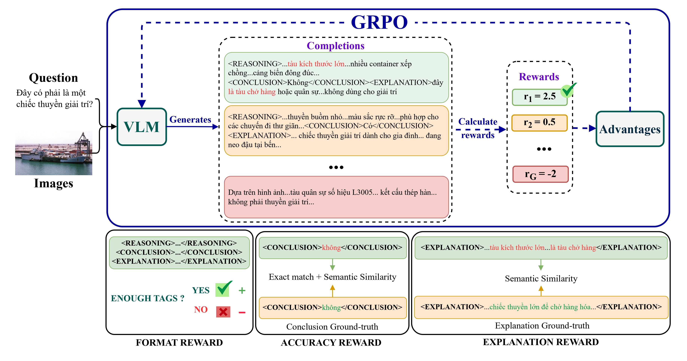

# Enhancing Vietnamese VQA-NLE via Learning to Explain with GRPO

[](./docs/paper/ICISN2026_GRPO_VQA-NLE.pdf)
[](LICENSE)

**Official implementation** of the paper "Enhancing Vietnamese VQA-NLE via Learning to Explain with GRPO" (ICISN 2026).

## 💡 Overview

We introduce a novel approach to improve Vietnamese Visual Question Answering (VQA) and Natural Language Explanations (NLE) using **Group Relative Policy Optimization (GRPO)**. 

<p align="center">
  
</p>

By decoupling **reasoning (thinking)** from **explanation**, we achieve state-of-the-art performance on the ViVQA-X benchmark, enabling models to provide accurate answers with high-quality, interpretable rationales.

## 🔑 Key Features

- **Composite Reward System**:
  - **Format Reward**: Ensures structured output (`<REASONING>`, `<CONCLUSION>`, `<EXPLANATION>`).
  - **Accuracy Reward**: Hybrid metric (BERTScore + ROUGE) handling Vietnamese synonyms.
  - **Explanation Reward**: Optimizes semantic alignment for rationales.
- **SOTA Performance**: Achieves **62.65%** accuracy on ViVQA-X, outperforming SFT and standard baselines.

## 🗂 Project Structure

```
VINLE-GRPO/
├── configs/                        # ✨ Configuration files
│   ├── grpo/                      # GRPO experiments
│   │   ├── vinle_full.yaml       # Full method (R+C+E)
│   │   └── ablation_think_answer.yaml # Ablation (R+C)
│   └── sft/                       # SFT experiments
│       └── baseline.yaml          # SFT baseline (C+E)
│
├── external/                       # External dependencies 
│   ├── ms-swift/                  # Modified ms-swift framework
│   │   └── examples/train/       
│   │       ├── grpo/internal/run_grpo.sh  # GRPO runner script
│   │       └── sft/run_sft.sh             # SFT runner script
│   └── smile/                     # SMILE evaluation metric
│
├── src/                            # Research code
│   ├── data/                      # Data processing
│   ├── rewards/                   # Reward logic
│   └── ...
│
└── output/                         # Training outputs & checkpoints
```

## 🚀 Getting Started

### 1. Installation

```bash
git clone https://github.com/T-Sunm/VINLE-GRPO.git
cd VINLE-GRPO
git submodule update --init --recursive
```

### 2. Environment Setup

```bash
# Create conda environment
conda create -n vqa-nle python=3.10 -y
conda activate vqa-nle

# Install dependencies (adjust based on your setup)
bash scripts/setup/install_env.sh
```

## 🎯 Quick Start (Complete Workflow)

```bash
# 1. Generate training data
python -m src.data.dataset_loader --mode grpo --split train

# 2. Train with GRPO
bash external/ms-swift/examples/train/grpo/internal/run_grpo.sh \
    configs/grpo/vinle_full.yaml
# → Note checkpoint path from output logs

# 3. Merge LoRA weights
# Edit merge_lora.sh with your checkpoint path first!
vim external/ms-swift/examples/train/grpo/internal/merge_lora.sh
bash external/ms-swift/examples/train/grpo/internal/merge_lora.sh

# 4. Run inference (use merged model)
python -m src.inference.run_inference_grpo \
    --model output/grpo/vinle_full/v0-YYYYMMDD-HHMMSS/checkpoint-XXXX-merged \
    --mode grpo \
    --limit 100  # Test with 100 samples first
```

## ⚡ Workflow

### 1. Data Preparation

Generate data for different training modes:

```bash
# 1. Full GRPO (Reasoning + Conclusion + Explanation)
python -m src.data.dataset_loader --mode grpo --split train

# 2. Ablation (Reasoning + Conclusion only)
python -m src.data.dataset_loader --mode think_answer --split train

# 3. SFT Baseline (Conclusion + Explanation only)
python -m src.data.dataset_loader --mode sft --split train
```

Data will be saved to `data/processed/`.

### 2. Training with YAML Configs

We support three main training modes, configured via YAML files.

#### A. Full GRPO (Our Method)
Uses all 3 tags and all rewards (Accuracy + Format + Explanation).

```bash
# Edit config if needed
vim configs/grpo/vinle_full.yaml

# Run training
bash external/ms-swift/examples/train/grpo/internal/run_grpo.sh \
    configs/grpo/vinle_full.yaml
```

#### B. Ablation Study (No Explanation Reward)
Uses only Reasoning + Conclusion tags. No explanation reward.

```bash
# Run training
bash external/ms-swift/examples/train/grpo/internal/run_grpo.sh \
    configs/grpo/ablation_think_answer.yaml
```

#### C. SFT Baseline
Standard supervised fine-tuning. Uses Conclusion + Explanation tags.

```bash
# Run training
bash external/ms-swift/examples/train/sft/run_sft.sh \
    configs/sft/baseline.yaml
```

### 3. Monitoring

Training logs are reported to WandB (if enabled in config) and saved in `output/`.

```bash
# Check training progress
tail -f output/grpo/vinle_full/runs.log
```

### 4. Merge LoRA Weights

After training completes, check the output for checkpoint location:

```
Train: 100%|████████████████████| 2/2 [03:10<00:00, 95.29s/it]
[INFO:swift] last_model_checkpoint: /path/to/output/grpo/vinle_full/v0-20251229-135812/checkpoint-2
```

**Step-by-step:**

1. **Find your checkpoint path** from training logs (example above)

2. **Edit merge script** with your checkpoint path:
```bash
vim external/ms-swift/examples/train/grpo/internal/merge_lora.sh
```

Update these variables:
```bash
BASE_MODEL="OpenGVLab/InternVL3_5-2B"  # Should match your training
MODEL_TYPE="internvl3"                 # Should match your training
CHECKPOINT_PATH="/home/.../output/grpo/vinle_full/v0-YYYYMMDD-HHMMSS/checkpoint-XXXX"
```

3. **Run merge:**
```bash
bash external/ms-swift/examples/train/grpo/internal/merge_lora.sh
```

4. **Merged model location:**
```
v0-YYYYMMDD-HHMMSS/checkpoint-XXXX-merged/
```

Example:
```
output/grpo/vinle_full/v0-20251229-135812/checkpoint-2
                                                    ↓
output/grpo/vinle_full/v0-20251229-135812/checkpoint-2-merged/  ← Use this for inference
```

### 5. Inference

We provide **5 separate inference scripts** for InternVL/Vintern models:

#### A. Zero-shot (Base Model Evaluation)
```bash
python -m src.inference.internvl_based.zero_shot \
    --model OpenGVLab/InternVL3_5-2B \
    --output_dir results/inference/zeroshot \
    --limit 100  # Optional: test with 100 samples
```

#### B. SFT Baseline (C+E)
```bash
python -m src.inference.internvl_based.sft \
    --model output/sft/baseline/v0-YYYYMMDD-HHMMSS/checkpoint-XXXX-merged \
    --output_dir results/inference/sft
```

#### C. OTA Ablation (R+C)
```bash
python -m src.inference.internvl_based.ota \
    --model output/grpo/ablation_think_answer/v0-YYYYMMDD-HHMMSS/checkpoint-XXXX-merged \
    --output_dir results/inference/ota
```

#### D. OEA Ablation (C+E)
```bash
python -m src.inference.internvl_based.oea \
    --model output/grpo/ablation_explain_answer/v0-YYYYMMDD-HHMMSS/checkpoint-XXXX-merged \
    --output_dir results/inference/oea
```

#### E. Full GRPO - Our Method (R+C+E)
```bash
python -m src.inference.internvl_based.grpo \
    --model output/grpo/vinle_full/v0-YYYYMMDD-HHMMSS/checkpoint-XXXX-merged \
    --output_dir results/inference/grpo
```

**Common arguments:**
- `--data_path` - Test data JSON (default: ViVQA-X test)
- `--image_folder` - Image directory (default: COCO val2014)
- `--output_name custom_name` - Custom output filename
- `--limit 100` - Process only 100 samples (for testing)
- `--device cpu` - Use CPU instead of GPU

**Comparison of inference modes:**

| Mode | Script | Reasoning | Answer | Explanation | Use Case |
|------|--------|-----------|--------|-------------|----------|
| Zero-shot | `zero_shot.py` | ❌ | ✅ | ❌ | Base model |
| SFT | `sft.py` | ❌ | ✅ | ✅ | SFT baseline |
| OTA | `ota.py` | ✅ | ✅ | ❌ | Ablation (no explain reward) |
| OEA | `oea.py` | ❌ | ✅ | ✅ | Ablation (no reasoning reward) |
| **GRPO** | `grpo.py` | ✅ | ✅ | ✅ | **Full method (ours)** |

**Output format** (consistent across all modes):
```json
{
  "image_id": 123,
  "question": "What is in the image?",
  "answer": "Ground truth answer",
  
  "pred_reasoning": "Suy luận..." (empty if not applicable),
  "pred_answer": "Câu trả lời",
  "pred_explanation": "Giải thích..." (empty if not applicable),
  "raw_response": "Full model response"
}
```

## 📝 Configuration Rules

To create new experiments, simply copy a YAML config and modify it:

1.  **Duplicate config**: `cp configs/grpo/vinle_full.yaml configs/grpo/my_experiment.yaml`
2.  **Edit parameters**: Change `learning_rate`, `max_steps`, etc.
3.  **Run**: `bash external/ms-swift/examples/train/grpo/internal/run_grpo.sh configs/grpo/my_experiment.yaml`

**Important**: Always update `output.dir` in your new config to avoid overwriting previous results.

## � Results

### Main Results

| Method | Backbone | Acc ↑ | SMILE ↑ | BS ↑ |
|--------|----------|-------|---------|------|
| Base (Zero-shot) | Vintern-3B | 54.83 | 56.00 | 51.90 |
| SFT | Vintern-3B | 46.60 | 51.45 | 53.69 |
| GRPO (DeepSeek) | Vintern-3B | 56.15 | 57.07 | 52.20 |
| **GRPO (Ours)** | **Vintern-3B** | **62.65** | **60.42** | **52.81** |

### Ablation Study

| Method | Acc ↑ | SMILE ↑ | BS ↑ |
|--------|-------|---------|------|
| GRPO (Full) | **62.7** | **60.4** | **52.8** |
| w/o Reasoning | 42.8 | 54.7 | 53.9 |
| w/o Explanation | 47.4 | 56.7 | 50.7 |

## 📧 Contact

For questions, please contact **Quang-Minh Tran** or **Phat-Dat To**.