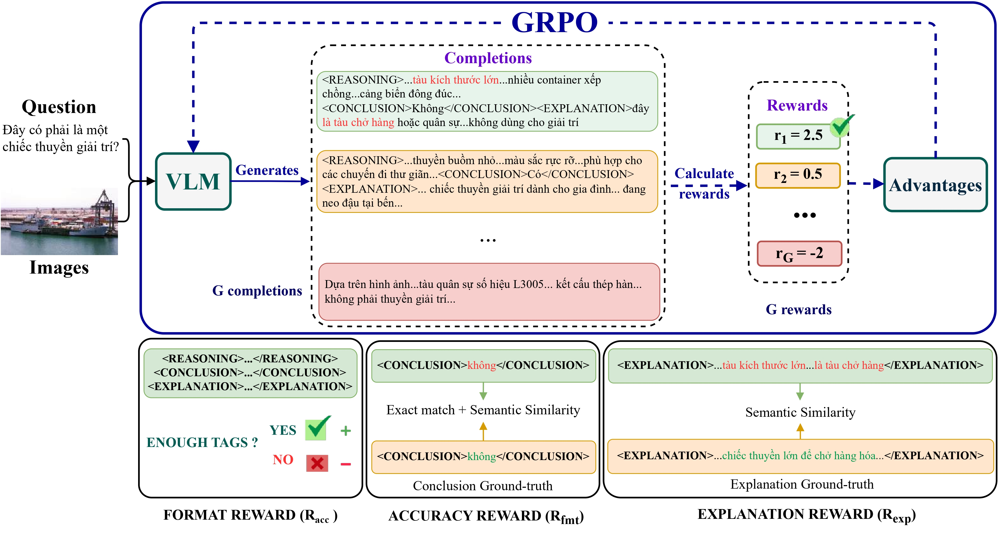

# VINLE-GRPO: Enhancing Vietnamese VQA-NLE via Learning to Explain with GRPO

[](./docs/paper/ICISN2026_GRPO_VQA-NLE.pdf)
[](LICENSE)

An adaptation of Group Relative Policy Optimization (GRPO) for the Vietnamese Visual Question Answering with Natural Language Explanations (VQA-NLE) task .


---

## Overview

Applying Reinforcement Learning (RL) techniques, specifically Group Relative Policy Optimization (GRPO), to the Vietnamese Visual Question Answering with Natural Language Explanations (VQA-NLE) domain. The core objective is to mitigate hallucinations and improve reasoning transparency by explicitly decoupling the model's generation process into three distinct phases: Reasoning, Conclusion, and Explanation, driven by a composite reward mechanism.

<p align="center">
  
</p>

---

## Method

The approach utilizes a composite reward function tailored for vision-language models. Instead of standard supervised fine-tuning (SFT), the model is optimized using GRPO. The generation is strictly formatted into `<think>...</think><answer>...</answer><explanation>...</explanation>`. Multi-faceted rewards are assigned:
- **Format Reward:** Ensures the model adheres strictly to the XML-like structure.
- **Accuracy Reward:** Validates the correctness of the generated conclusion/answer.
- **Explanation Reward (SMILE):** Measures the quality and semantic relevance of the generated natural language reasoning.

This decouples the reasoning process and effectively aligns the model's outputs using the Vintern-3B backbone.

---

## Repository Structure

```
VINLE-GRPO/
├── configs/             # YAML configurations for GRPO and SFT pipelines
│   ├── grpo/            # configs/grpo/vinle_full.yaml (Main training entrypoint config)
│   └── sft/             # Supervised fine-tuning baselines
├── data/                # Dataset directory (contains raw ViVQA-X and outputs)
├── external/            # Submodules (ms-swift framework and smile-metric)
├── notebooks/           # Exploratory and experimental Jupyter notebooks
├── scripts/             # Useful wrapper scripts for inference, data, eval, and setup (see scripts/README.md)
│   └── eval/            # Evaluation execution scripts
│       └── eval_grpo.sh # Main evaluation entrypoint
├── src/                 # Main research source code
│   ├── data/            # Dataset prep script: dataset_loader.py
│   ├── evaluation/      # Eval scripts (SMILE, accuracy)
│   ├── inference/       # Inference modes: grpo, oea, ota, sft, zero_shot
│   ├── rewards/         # Specific GRPO reward functions (format, acc, explanation)
│   └── utils/           # Shared utilities
├── install_env.sh       # Main environment setup script (PyTorch, Flash Attention)
└── requirements.txt     # Python dependencies
```

---

## Quick Start

### 1. Installation

The repository relies on `conda` and `pip`. To prevent dependency conflicts between the LLM training framework and evaluation metrics, we separate them into two distinct environments:

```fish
# Clone repo & submodules
git clone https://github.com/T-Sunm/VINLE-GRPO.git
cd VINLE-GRPO
git submodule update --init --recursive

# =================================================================
# Environment 1: Training, Inference & SMILE Metrics
# =================================================================
conda create -n vqa-nle-swift python=3.11 -y
conda activate vqa-nle-swift
bash install_env.sh

# Configure Weights & Biases for logging
set -x WANDB_ENTITY <team-name>
set -x WANDB_PROJECT vinle_grpo

# =================================================================
# Environment 2: General Evaluation (BERTScore, Accuracy, BLEU, etc.)
# =================================================================
conda create -n vqa-nle-eval python=3.11 -y
conda activate vqa-nle-eval
bash install_env_eval.sh
```

---

### 2. Data Preparation

- **Dataset:** [ViVQA-X](https://huggingface.co/datasets/VLAI-AIVN/ViVQA-X) (Vietnamese Visual Question Answering with Explanations).
- **Download:** You can automatically download the raw JSON dataset using the provided setup script:
  ```fish
  python scripts/setup/download_vivqax.py
  ```
- **Raw Format:** The raw dataset consists of JSON objects with the following structure:
  ```json
  {
    "question": "Đây là phòng nào?",
    "image_id": "524822",
    "image_name": "COCO_val2014_000000524822.jpg",
    "explanation": [
      "nó là một phòng có ghế sofa và tivi",
      "căn phòng này có một lò sưởi, một chiếc ghế dài, nhiều ghế bành và một chiếc tivi gắn trên tường",
      "có một chiếc ghế sofa kiểu chữ L và một chiếc tivi và lò sưởi"
    ],
    "answer": "phòng khách",
    "question_id": "524822007"
  }
  ```
  *Fields explanation:*
  - `question`: The question asked about the image.
  - `image_id`: The ID of the image from the original COCO dataset.
  - `image_name`: The file name of the COCO image used to reference the specific image.
  - `explanation`: A list of explanations.
  - `answer`: The answer to the question (translation of the most common answer from the original dataset).
  - `question_id`: The ID of the question.

- **Preparation:** The raw data needs to be processed into a `.jsonl` format suitable for the GRPO pipeline:
```fish
python -m src.data.dataset_loader --mode grpo --split train
```

---

### 3. Training & LoRA Merging

Training is executed via the `ms-swift` submodule framework driven by YAML configuration files.

```fish
# Run full GRPO training
bash external/ms-swift/examples/train/grpo/internal/run_grpo.sh configs/grpo/vinle_full.yaml
```

**Main Parameters (from `configs/grpo/vinle_full.yaml`):**
- `target_modules`: `all-linear` (LoRA training)
- `max_steps`: `4000`
- `per_device_train_batch_size`: `2`
- `learning_rate`: `1.0e-5`
- `torch_dtype`: `bfloat16` with `flash_attention_2`
- **GPU/VRAM Note:** Uses GPU `1` by default (`environment.cuda_visible_devices: "1"`). Modify the config file directly as needed. Memory management uses `pytorch_cuda_alloc_conf: "expandable_segments:True"`.

> **Optional:** Merge the LoRA adapters after training:
```fish
bash external/ms-swift/examples/train/grpo/internal/merge_lora.sh outputs/training/grpo/vinle_full/<timestamp>/checkpoint-4000
```

---

### 4. Evaluation & Inference

#### Inference
Use our pre-configured wrapper script to quickly generate outputs. Predictions are automatically versioned and saved to `outputs/inference/grpo/`.

```fish
# Ensure the primary environment is active
conda activate vqa-nle-swift

# Set your model path dynamically
set -x GRPO_MODEL_PATH outputs/training/grpo/vinle_full/<timestamp>/checkpoint-4000-merged

# Run inference wrapper on 10 samples
bash scripts/inference/run_grpo.sh 10
```

#### Evaluation
The repository computes Accuracy and SMILE metrics automatically, safeguarding against CUDA asserts via automated text sanitization. Ensure you activate the **corresponding environment** for your target metric.

```fish
# 1. Evaluate General NLG Metrics (Accuracy, BERTScore, BLEU) - requires Eval env
conda activate vqa-nle-eval
bash scripts/eval/eval_grpo.sh

# 2. Evaluate SMILE Metric (Synthetic Answer Generation via LLM) - requires Swift env
conda activate vqa-nle-swift
bash scripts/eval/eval_smile_grpo.sh
```

> **For deep-dive manual executions (running raw Python commands), custom parameters, evaluating ablation models (OTA, OEA), or other helper scripts, see the [Scripts Toolkit README](scripts/README.md).**

---

## Results

**ViVQA-X Test Set (Vintern-3B Backbone):**

| Method | Acc ↑ | SMILE ↑ | BS ↑ | CLIP ↑ |
|:---:|:---:|:---:|:---:|:---:|
| Base (Zero-shot) | 54.83 | 56.00 | 51.90 | 19.29 |
| SFT | 46.60 | 51.45 | 53.69 | 19.43 |
| GRPO (DeepSeek) | 56.15 | 57.07 | 52.20 | 19.07 |
| **GRPO (Ours)** | **62.65** | **60.42** | **52.81** | **20.71** |

---

## Citation

If you find this repository useful, please consider citing the paper:

```bibtex
@inproceedings{vinle-grpo-2026,
  title={Enhancing Vietnamese VQA-NLE via Learning to Explain with GRPO},
  author={Quang-Minh Tran and Phat-Dat To and Huu-Phuoc Le and Duc-Manh Nguyen and Truong-Binh Duong},
  booktitle={Proceedings of ICISN 2026},
  year={2026}
}
```

Please also refer to `assets/CITATION.cff` for citation metadata.

---

## License & Acknowledgements

This project is licensed under the [MIT License](LICENSE). 
Acknowledgements: 
- [ms-swift](https://github.com/modelscope/ms-swift) for the GRPO training framework.
- [SMILE](https://github.com/smile-metric/smile) for text evaluation metrics.